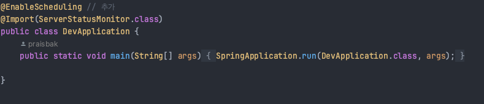

# EasySimpleMonitoring
간편하게 actuator를 이용한 cpu 점유율, 메모리 점유율, 디스크 할당량을 모니터링하고 문제가 생길시 메일전송을 해주는 라이브러리입니다   

# 사용법
gradlew build 후 라이브러리를 import하면 됩니다

## 예제)
   
위와 같이 build.gradle에서 설정


위와 같이 메인 애플리케이션에서 Import 및 스케줄링 설정   


위와 같은 문구가 출력되면 설치 성공!

# 설정
```
#email send를 활성화시 다음의 프로퍼티를 모두 작성해줘야합니다
easy.monitoring.mail.enable=true
spring.mail.host=smtp.gmail.com
spring.mail.port=587
spring.mail.username=
spring.mail.password=
spring.mail.properties.mail.smtp.auth=true
spring.mail.properties.mail.smtp.starttls.enable=true
spring.mail.properties.mail.smtp.ssl.trust=smtp.gmail.com
easy.monitoring.mail.receiver.name=
easy.monitoring.mail.sender.name=

#알람을 보내는 모니터링 기준값입니다 커스터마이징이 가능합니다
#easy.monitoring.send.duration = 3600000
#easy.monitoring.disk.free.threshold=1073741824
#easy.monitoring.memory.usage.threshold=80
#easy.monitoring.cpu.usage.threshold=80
```


